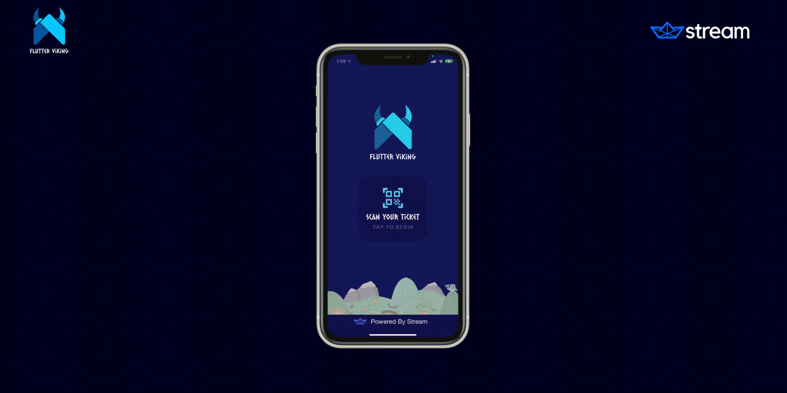

# Build Viking 🛠

This repo contains sample code for Stream's Build Viking activity. 

### Prerequisites 🧬
This to run this application, you must have the following:
- Flutter `1.24.0-7.0.pre` or higher installed
- A [Stream](https://bit.ly/35mihAp) account 
- An `api.dart` file in `lib/` containing the following:
```dart
class API {
  static const apiUrl =
      "YOUR_API_URL";
  static const streamApi = "YOUR_STREAM_API_KEY";
}
```

### Build Instructions 
This project consists of two parts, the application (this repo) and a simple API that verifies a Flutter Viking ticket ID and creates a [Stream] user associated with that ID.

You can implement a custom API using the sample code below or remove it entirely by eliminating the call to `__fetchUserAccount` on line 20 of `lib/services/api_service.dart`. In its place, you can return an instance of `VikingUser` containing placeholder information.

> Note, if you chose the latter, you would need to generate a user token manually using our [online tool](https://getstream.io/chat/docs/token_generator/?language=dart).   
```js
import { StreamChat } from 'stream-chat';
import axios from 'axios';

export const stream = async event => {
	const data = JSON.parse(event.body);

	try {
		const res = await axios.get(`${process.env.TICKET_URL}${data.id}`, {
			headers: {
				Authorization: `Token token=${process.env.TICKET_SECRET}`,
				'Content-Type': 'application/json',
			},
		});

		const client = new StreamChat(process.env.STREAM_API_KEY, process.env.STREAM_API_SECRET);

		const ticket = res.data.ticket;

		const user = {
			id: ticket.id.toString(),
			name: ticket.name,
			role: 'channel_member',
			image: 'https://stream-blog-v2.imgix.net/blog/wp-content/uploads/35e4570ddc67c374f9dbbf57c743acaa/dash.png',
		};

		const token = client.createToken(user.id);

		await client.upsertUser(user);

		return {
			statusCode: 200,
			headers: {
				'Access-Control-Allow-Origin': '*',
			},
			body: JSON.stringify({
				data: {
					token,
					id: user.id,
					name: user.name,
					image: user.image,
				},
			}),
		};
	} catch (error) {
		console.error(error);
		
		return {
			statusCode: error.response.status,
			headers: {
				'Access-Control-Allow-Origin': '*',
			},
			body: JSON.stringify({
				message: error.message,
			}),
		};
	}
};
```

Finally, you can run the application using regular Flutter build commands. 

1. Run `flutter packages get` to install the project dependencies 
2. Launch the application in debug mode using `flutter run -d <name-of-your-device>`

Happy Hacking!
